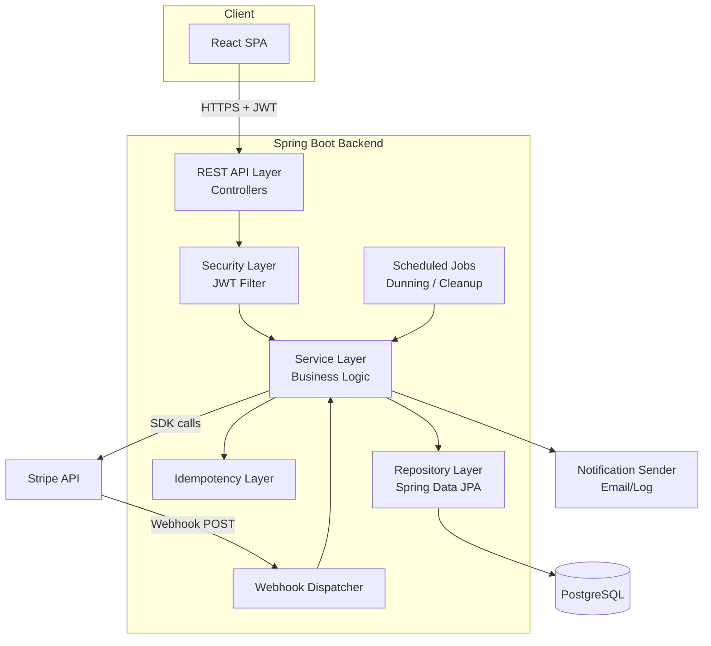
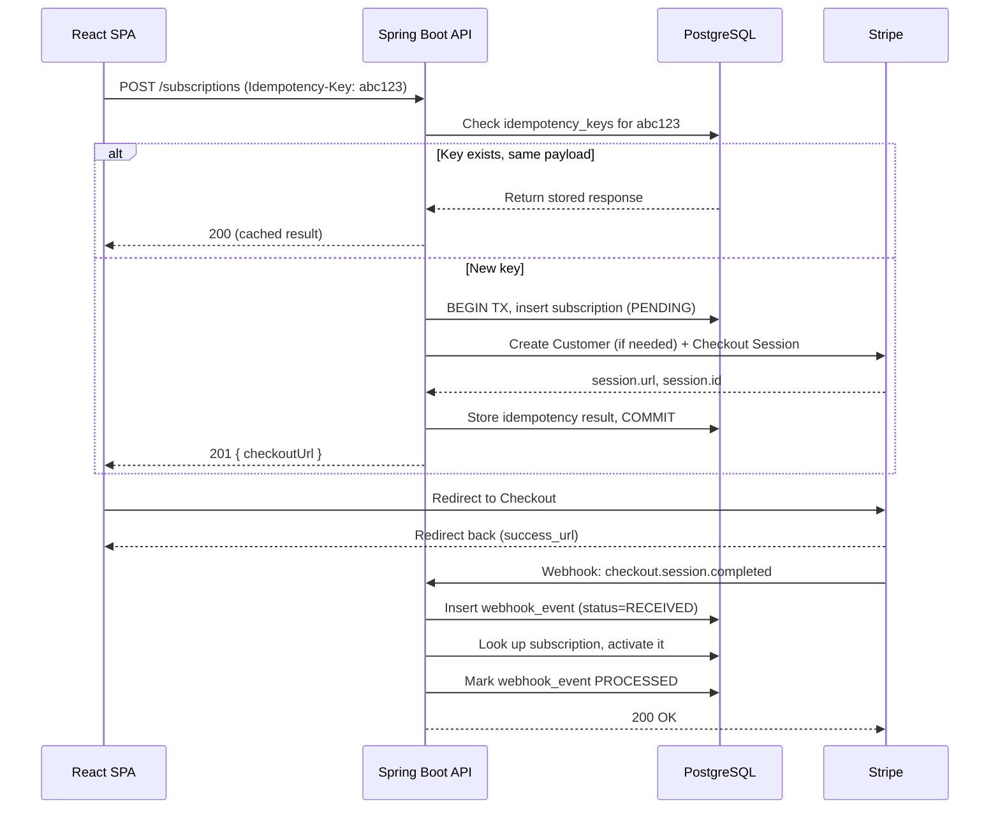
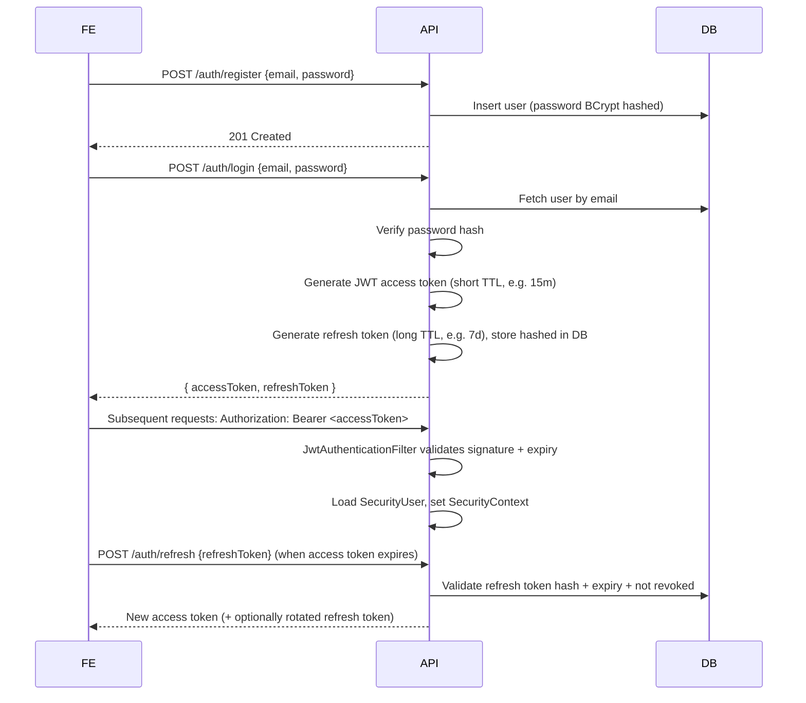
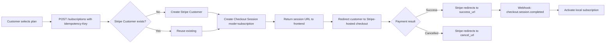
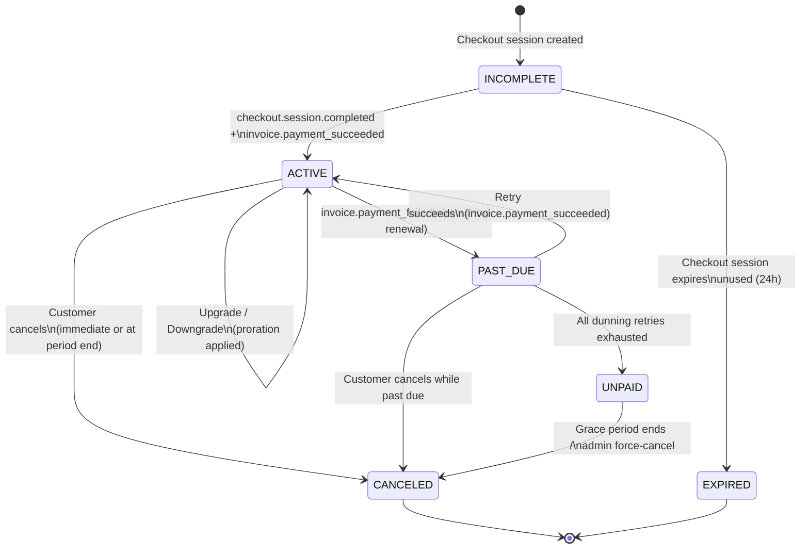
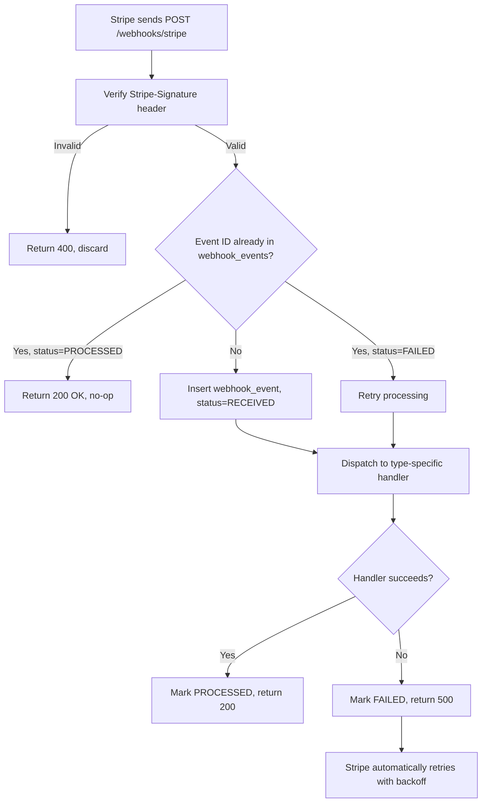
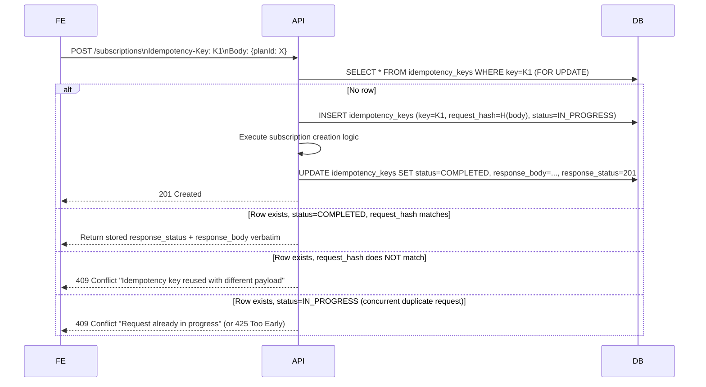
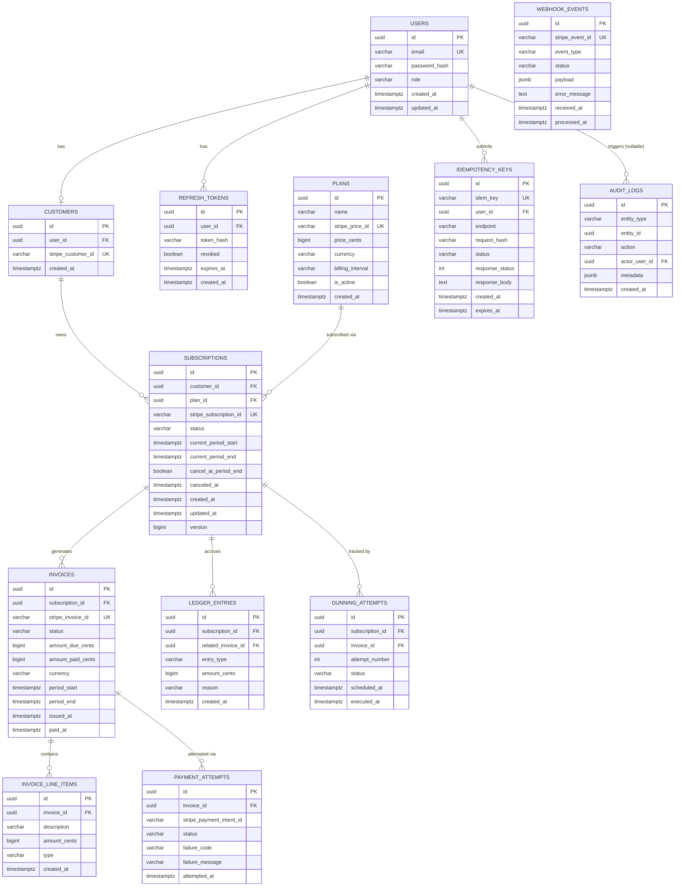

# ARCHITECTURE.md — Subscription Billing Platform

## 1. High-Level Architecture

The system is a classic layered monolith on the backend (deliberately — a distributed system is not
needed to demonstrate billing-engineering depth, and a monolith keeps transaction boundaries simple
and correct, which matters enormously for money-handling code) fronted by a decoupled SPA, integrated
with Stripe as an external payment processor.

### Layer Responsibilities
- **Controller layer**: HTTP concerns only — request validation, auth context extraction, response
  shaping. No business rules.
- **Service layer**: All business rules, transaction boundaries, orchestration across repositories
  and the Stripe SDK.
- **Idempotency layer**: A cross-cutting concern implemented as a service + interceptor/aspect that
  wraps mutating endpoints, checks/stores idempotency keys before delegating to the service layer.
- **Repository layer**: Spring Data JPA repositories, one per aggregate root.
- **Webhook dispatcher**: Verifies signatures, persists raw events, routes to per-event-type handlers,
  each of which calls into the same service layer used by the REST API (no duplicated business logic
  between the "user-initiated" and "Stripe-initiated" paths).
- **Scheduler**: Spring `@Scheduled` jobs for dunning retries and idempotency-key/webhook-event
  cleanup, calling into the service layer identically to the controller layer.

This "everything funnels through the service layer" rule is the single most important architectural
invariant: **there must never be two separate code paths that can both mark a subscription ACTIVE**,
one for user actions and one for webhooks. Both call `SubscriptionService`.

## 2. Component Interactions

## 3. Authentication Flow

Design notes:
- Access tokens are stateless JWTs (HS256 or RS256 — RS256 recommended if the frontend or another
  service ever needs to verify tokens independently; HS256 is sufficient and simpler for a single-
  backend portfolio project — **recommendation: HS256 for MVP, documented as an upgrade path**).
- Refresh tokens are stored **hashed** (not raw) in a `refresh_tokens` table, enabling server-side
  revocation (logout, password change) — a pure-stateless refresh token cannot be revoked, which is
  unacceptable for a security-conscious design.
- Claims: `sub` (user id), `role`, `iat`, `exp`. No sensitive data in the JWT payload (it's base64,
  not encrypted).

## 4. Stripe Payment Flow

**Recommendation: Stripe Checkout Session** (hosted page) for MVP over raw Payment Intents + Elements,
because:
- It offloads PCI scope and UI complexity entirely to Stripe.
- It natively supports subscription-mode sessions tied to a Stripe Price, which simplifies initial
  subscription creation.
- Elements/Payment Intents (embedded custom form) is documented as the "advanced" alternative for
  teams wanting full UI control — trade-off: more PCI/UI responsibility, more code, more polished
  demo of raw Payment Intent handling if the implementer wants to showcase that instead.

## 5. Subscription Lifecycle (State Machine)

| Status | Meaning | Access Granted? |
|---|---|---|
| `INCOMPLETE` | Checkout session created, payment not yet confirmed | No |
| `ACTIVE` | Subscription paid and current | Yes |
| `PAST_DUE` | Latest invoice payment failed, within dunning retry window | Yes (grace period, configurable) then No |
| `UNPAID` | Dunning exhausted, payment not recovered | No |
| `CANCELED` | Terminated (by customer or system) | No |
| `EXPIRED` | Checkout never completed | No |

Every transition is driven by exactly one of: (a) a validated user API call, (b) a processed webhook
event, (c) a scheduled job (dunning exhaustion, checkout expiry sweep). Each transition is recorded
via `AuditLogService` with the triggering cause.

## 6. Webhook Lifecycle

Key design decisions:
- **Persist-before-process**: the raw event is written to `webhook_events` in its own short
  transaction *before* business processing begins, so even if processing crashes mid-way, we know
  the event was received and can be reprocessed/audited.
- **Idempotent handlers, not just dedup**: even though the `webhook_events` table prevents
  reprocessing the *same event ID* twice, individual handlers are still written idempotently
  (e.g., "set status to ACTIVE" rather than "increment a counter") because Stripe can send different
  event IDs that describe the same effective state (e.g., a subscription update webhook arriving
  twice with different event IDs due to Stripe-side retries after a timeout on our end before we
  even wrote the response).
- **Return 200 quickly**: handler logic that triggers slow side effects (email sending) should be
  fast or deferred; Stripe times out webhook responses at 10s and will treat timeout as failure,
  triggering redelivery.
- **Ordering is not guaranteed**: handlers must tolerate out-of-order delivery, e.g., a
  `customer.subscription.updated` arriving after a later `customer.subscription.deleted` for the
  same subscription. Mitigation: compare Stripe's event `created` timestamp (or the object's
  `current_period_end`/version-like fields) against the locally stored "last synced from Stripe at"
  timestamp, and discard/ignore updates older than what's already applied ("last-writer-wins by
  Stripe event timestamp," not by arrival order).

## 7. Idempotency Flow

Concurrency safety: the `idempotency_keys.key` column has a **unique constraint**, and the
"check-then-insert" is done as an atomic `INSERT ... ON CONFLICT DO NOTHING` followed by a check of
what was actually persisted (or a `SELECT ... FOR UPDATE` inside the transaction) — never a plain
"SELECT, then decide, then INSERT" without a DB-level uniqueness guarantee, because that has a TOCTOU
race under concurrent duplicate requests. This is detailed further in IMPLEMENTATION.md §"Idempotency
Implementation."

## 8. Database Schema

### 8.1 ER Diagram

### 8.2 Table-by-Table Explanation

- **`users`**: Auth identity. `role` is `CUSTOMER`/`ADMIN`. Password stored as BCrypt hash only.
- **`customers`**: 1:1 link between an internal `user` and a Stripe `Customer` object. Kept separate
  from `users` because "customer" is a *billing* concept (could later support one user owning
  multiple billing customers, e.g., personal + team billing — extension point).
- **`plans`**: The catalog. `stripe_price_id` links to a Stripe `Price` object (Stripe is the source
  of truth for the actual chargeable price object; our row stores a local cache of price/interval
  for fast reads and referential integrity for `subscriptions.plan_id`). `is_active=false` archives a
  plan without deleting history.
- **`subscriptions`**: The core aggregate. `status` mirrors the state machine in §5.
  `current_period_start/end` mirror Stripe's billing period for the active cycle. `version` is an
  optimistic-locking column (`@Version` in JPA) — critical because subscription rows are written
  from **both** the API path (upgrade/downgrade/cancel) and the webhook path concurrently; optimistic
  locking prevents lost updates.
- **`invoices`**: One row per Stripe invoice (recurring renewal) **and** per proration adjustment
  invoice generated at upgrade/downgrade time. `amount_due_cents`/`amount_paid_cents` are integer
  cents.
- **`invoice_line_items`**: Line-item breakdown (`type` ∈ `SUBSCRIPTION`, `PRORATION_CREDIT`,
  `PRORATION_DEBIT`, `TAX` (future)). This is what lets the UI show "Credit for 12 unused days on
  Basic plan: -$4.80 / Charge for 12 days on Pro plan: +$9.60" instead of one opaque number.
- **`ledger_entries`**: An append-only financial ledger, separate from invoice line items, that
  records every credit/debit event against a subscription's "account balance" concept. This is what
  makes proration auditable independent of invoice presentation — every ledger entry must net to
  zero against its paired entries system-wide (a debit always has a matching credit somewhere), and
  this table is what a unit test asserts against for proration correctness.
- **`payment_attempts`**: One row per Stripe PaymentIntent attempt against an invoice — this is the
  raw material for the dunning retry history.
- **`dunning_attempts`**: The scheduled/executed retry timeline for a specific failed invoice,
  distinct from `payment_attempts` (a dunning attempt *causes* a payment attempt to be made; keeping
  them separate lets us schedule future attempts before they execute).
- **`idempotency_keys`**: Backing store for FR18–21. `request_hash` = SHA-256 of the canonicalized
  request body, so a replay with a different body is detectable. `expires_at` supports the cleanup
  job.
- **`webhook_events`**: Backing store for webhook dedup (§6). `payload` stored as `jsonb` for
  debuggability/replay.
- **`refresh_tokens`**: Enables revocation (§3).
- **`audit_logs`**: Generic append-only audit trail; `entity_type`/`entity_id` point at the affected
  row (e.g., `SUBSCRIPTION`/subscription id), `action` is a short code
  (`SUBSCRIPTION_UPGRADED`, `DUNNING_RETRY_SCHEDULED`, etc.), `metadata` holds a JSON diff/context
  blob, `actor_user_id` is nullable (system/scheduled actions have no human actor).

### 8.3 Indexing Strategy
- Unique indexes: `users.email`, `customers.stripe_customer_id`, `plans.stripe_price_id`,
  `subscriptions.stripe_subscription_id`, `invoices.stripe_invoice_id`, `idempotency_keys.idem_key`,
  `webhook_events.stripe_event_id`.
- `subscriptions.customer_id`, `invoices.subscription_id`, `dunning_attempts.subscription_id`,
  `ledger_entries.subscription_id` — foreign-key indexes for join performance.
- `dunning_attempts (status, scheduled_at)` composite index — the scheduler's poll query is
  `WHERE status='PENDING' AND scheduled_at <= now()`.
- `idempotency_keys (expires_at)` — cleanup job scan.
- `audit_logs (entity_type, entity_id, created_at DESC)` — "show history for this subscription" query.

## 9. API Design

RESTful, versioned under `/api/v1`. JSON request/response. Consistent envelope:
`{ data, error, meta }` for list endpoints (with `meta.page`, `meta.totalElements`); plain resource
JSON for single-resource endpoints (simpler for the frontend's React Query hooks). Errors follow
RFC 7807-style `{ type, title, status, detail, instance }`.

| Method | Path | Auth | Description |
|---|---|---|---|
| POST | `/api/v1/auth/register` | Public | Register new user |
| POST | `/api/v1/auth/login` | Public | Login, get token pair |
| POST | `/api/v1/auth/refresh` | Public (refresh token) | Rotate access token |
| POST | `/api/v1/auth/logout` | Auth | Revoke refresh token |
| GET | `/api/v1/plans` | Public | List active plans |
| POST | `/api/v1/admin/plans` | Admin | Create plan |
| PATCH | `/api/v1/admin/plans/{id}` | Admin | Update/archive plan |
| POST | `/api/v1/subscriptions` | Customer (Idempotency-Key required) | Create subscription (returns Checkout URL) |
| GET | `/api/v1/subscriptions/me` | Customer | Get own current subscription |
| POST | `/api/v1/subscriptions/me/change-plan` | Customer (Idempotency-Key required) | Upgrade/downgrade, returns proration preview + applies it |
| POST | `/api/v1/subscriptions/me/preview-change` | Customer | Dry-run proration preview, no side effects |
| POST | `/api/v1/subscriptions/me/cancel` | Customer (Idempotency-Key required) | Cancel (immediate or at period end) |
| GET | `/api/v1/invoices/me` | Customer | List own invoices (paginated) |
| GET | `/api/v1/invoices/{id}` | Customer/Admin (ownership checked) | Invoice detail with line items |
| POST | `/api/v1/webhooks/stripe` | Stripe signature | Webhook receiver |
| GET | `/api/v1/admin/subscriptions` | Admin | List all subscriptions, filterable |
| GET | `/api/v1/admin/customers` | Admin | List all customers |
| POST | `/api/v1/admin/subscriptions/{id}/force-cancel` | Admin | Force cancel |
| POST | `/api/v1/admin/subscriptions/{id}/retry-payment` | Admin | Manually trigger a dunning retry now |
| GET | `/api/v1/admin/audit-logs` | Admin | Query audit trail |

Idempotency-Key is a required custom header (`Idempotency-Key: <client-generated UUID>`) on every
POST listed above as requiring it; its absence returns `400 Bad Request` before any business logic
runs.

## 10. Design Patterns Used

- **Strategy pattern**: `WebhookEventHandler` implementations, one per Stripe event type, registered
  in a `Map<String, WebhookEventHandler>` inside `WebhookDispatcher` — adding a new event type means
  adding a new class, not editing a growing switch statement.
- **State pattern (lightweight)**: `SubscriptionStateMachine` centralizes valid transitions
  (`from status X, event Y -> status Z, else throw InvalidTransitionException`), rather than scattering
  `if (status == ...)` checks across services.
- **Template method**: `DunningPolicy` defines the retry schedule shape (attempt count, backoff
  intervals) as configuration consumed by a single `DunningService` algorithm — no per-plan
  subclassing needed for MVP, but designed so a `PlanSpecificDunningPolicy` could be introduced later.
- **Repository pattern**: Spring Data JPA repositories per aggregate root, as usual.
- **Adapter pattern**: `NotificationSender` interface with `LoggingNotificationSender` (default) and
  `EmailNotificationSender` (optional) implementations — the dunning service depends only on the
  interface.
- **Idempotent Receiver pattern** (from EIP): both the `IdempotencyService` (client-facing) and the
  webhook dedup mechanism (Stripe-facing) are textbook implementations of this pattern.
- **Value Object**: a `Money` type (amount in minor units + currency) used everywhere financial
  amounts are passed around internally, preventing accidental unit mismatches (e.g., adding cents to
  dollars).
- **Unit of Work (implicit via `@Transactional`)**: each service method that mutates multiple tables
  (e.g., "apply proration" touches `subscriptions`, `invoices`, `invoice_line_items`,
  `ledger_entries`) does so inside a single transaction, so either all rows commit or none do.

## 11. Transaction Boundaries

General rule: **one `@Transactional` service method = one atomic business operation**. Specific
boundaries:

- `SubscriptionService.createSubscription(...)`: local row insert (`PENDING`/`INCOMPLETE`) +
  idempotency key write happen in the same local transaction. The **Stripe API call happens outside
  the transaction that commits the final state**, following the "no external I/O inside a DB
  transaction that must be fast/short" principle — see the two-phase pattern in IMPLEMENTATION.md
  (write pending row → call Stripe → update row with Stripe IDs in a second short transaction, all
  reconciled idempotently if the process crashes between steps).
- `SubscriptionService.changePlan(...)` (upgrade/downgrade): proration calculation (pure, no I/O) +
  subscription row update + invoice + line items + ledger entries, **all in one transaction**, since
  these are purely local writes with no external I/O in the critical path (the Stripe-side
  subscription update call is made and, on success, the local transaction commits; on Stripe failure,
  the local transaction is rolled back — Stripe call happens first, then local commit, so we never
  have local state claiming a change that Stripe rejected).
- `WebhookDispatcher.handle(event)`: insert `webhook_events` row in its own short transaction
  (commits immediately, independent of processing outcome) — then a **separate** transaction wraps
  the actual handler business logic + marking the event `PROCESSED`. This two-transaction split is
  intentional: even if handler logic throws, we still have durable proof the event was received
  (visible to the cleanup/retry job and to admins debugging "did we get this webhook").
- `DunningService.executeScheduledAttempt(...)`: one transaction per attempt — update
  `dunning_attempts` row, create `payment_attempts` row, update subscription status if terminal,
  all together; the actual Stripe payment retry call happens before the transaction commits the
  outcome (same "external call, then commit the result" ordering as above).

## 12. Retry Strategy

Two distinct retry concerns exist and must not be conflated:

1. **Dunning retries** (business-level, ours to schedule): failed *recurring* invoice payments are
   retried on a schedule (default: immediately by Stripe's own Smart Retries if using Stripe-managed
   subscriptions, **plus** our own dunning workflow tracking status/notifications/access; for a
   portfolio project demonstrating engineering depth, we implement our **own** retry scheduling via
   `DunningScheduler` rather than relying solely on Stripe's built-in retry logic, so the resume claim
   "implemented a dunning workflow that retries failed payments" is literally true). Schedule:
   configurable list of offsets from first failure, default `[1d, 3d, 5d, 7d]`, 4 attempts, then
   `UNPAID`.
2. **Transient infrastructure retries** (technical-level): calls to the Stripe API from our backend
   (e.g., during checkout session creation) can fail due to network blips or Stripe rate limits.
   These use the Stripe SDK's built-in retry support (`StripeClient` configurable `setMaxNetworkRetries`)
   with exponential backoff, bounded to 2–3 attempts, and only for idempotent Stripe calls (Stripe
   itself supports an `Idempotency-Key` on outbound API calls — **we pass our own idempotency key
   through to Stripe's API calls too**, so a retried Stripe call cannot create a duplicate Stripe-side
   Customer/Subscription either).
- Webhook delivery retries are entirely Stripe's responsibility (Stripe retries with backoff for
  up to ~3 days on non-2xx responses) — our only job is to respond correctly and quickly, and to be
  safely re-invokable (§6).

## 13. Security Considerations

- Passwords: BCrypt, cost factor 12.
- JWT: short-lived access tokens (15 min), rotated refresh tokens stored hashed, revocation supported.
- Stripe webhook endpoint: signature verified via `Stripe-Signature` header + webhook signing secret
  (`STRIPE_WEBHOOK_SECRET` env var); requests failing verification are rejected with 400 and never
  reach business logic. This endpoint is explicitly excluded from CSRF protection (N/A, it's a
  server-to-server callback) but **is** rate-limited and logged.
- No PCI data: card numbers never touch our backend; Stripe Checkout/Elements handle collection.
- Secrets management: all Stripe keys, JWT signing secret, DB credentials via environment variables
  (`.env`, not committed; `.env.example` documents required vars), injected via Docker Compose /
  GitHub Actions secrets.
- Authorization: method-level checks (`@PreAuthorize("hasRole('ADMIN')")`) on admin endpoints in
  addition to URL-pattern security config, for defense in depth. Resource-level ownership checks
  (e.g., a customer can only fetch their own invoices) enforced in the service layer, not just via
  role.
- Input validation: Bean Validation (`@Valid`, `@NotNull`, `@Positive`, etc.) on all request DTOs;
  global exception handler prevents stack traces leaking to clients.
- SQL injection: prevented structurally via JPA/parameterized queries; no string-concatenated JPQL/
  native queries.
- CORS: explicit allow-list of the frontend origin(s) only.
- Rate limiting: documented as an advanced feature (e.g., bucket4j) for public auth endpoints to
  mitigate credential stuffing; not required for MVP but the extension point (a filter before the
  security filter chain) is documented here for completeness.

## 14. Scalability Considerations

This is a portfolio project (single instance is fine to run), but the design should demonstrate
awareness of scale:

- **Statelessness**: The API is stateless (JWT-based auth, no server-side session), so horizontal
  scaling behind a load balancer is trivial for the API tier itself.
- **Scheduled jobs and clustering**: Spring `@Scheduled` jobs are **not** safe to run on more than one
  instance without coordination (duplicate dunning retries would fire). Documented mitigation:
  either (a) run the scheduler on a single designated instance/profile, or (b) migrate to Quartz with
  a JDBC `JobStore`, which provides cluster-safe locking — this trade-off is explicitly called out
  as a "if this were truly production, do X" note rather than implemented, to keep MVP scope sane.
- **Database as bottleneck**: All financial writes are relatively low-volume (subscription
  lifecycle events, not high-frequency trading), so a single well-indexed Postgres instance handles
  realistic portfolio-scale load; read replicas for admin reporting queries are a documented future
  step, not implemented.
- **Webhook idempotency enables safe redelivery at scale**: because processing is idempotent, Stripe
  (or a load balancer) can safely retry/duplicate delivery without a coordination layer.
- **Outbox-pattern note**: for a true production system processing thousands of webhooks/sec, event
  processing would be decoupled from the HTTP handler via an outbox table + async worker (to avoid
  holding the Stripe-facing HTTP connection open during slow processing). For this project's scale,
  synchronous processing within the 10s Stripe webhook timeout is acceptable and simpler; the outbox
  pattern is documented here as the next evolution, not built.
- **Caching**: Plan catalog (`GET /plans`) is a good candidate for a short-TTL cache (Caffeine) since
  it changes rarely and is read often — documented as an optional optimization.
